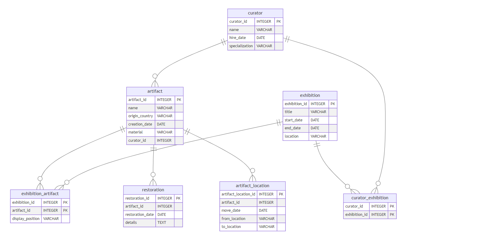

Description:
---------------------
The database represents a dataset for managing a museum's collections, exhibitions, and curator activities.

Questions that Worked
---------------------

### Question 1: Zero-shot Question

**Query**: How many artifacts are in the museum?

                `SELECT COUNT(*) FROM artifact;`

**Response**:

> The museum has 4 artifacts.

 

### Question 2: Zero-Shot Question
**Query**: Which artifacts have an origin country that is in Europe?

            SELECT artifact_id, name, origin_country
            FROM artifact
            WHERE origin_country IN ('Albania', 'Andorra', 'Armenia', 'Austria', 'Azerbaijan', 'Belarus', 'Belgium', 'Bosnia and Herzegovina', 'Bulgaria', 'Croatia', 'Cyprus', 'Czech Republic', 'Denmark', 'Estonia', 'Finland', 'France', 'Georgia', 'Germany', 'Greece', 'Hungary', 'Iceland', 'Ireland', 'Italy', 'Kazakhstan', 'Kosovo', 'Latvia', 'Liechtenstein', 'Lithuania', 'Luxembourg', 'Malta', 'Moldova', 'Monaco', 'Montenegro', 'Netherlands', 'North Macedonia', 'Norway', 'Poland', 'Portugal', 'Romania', 'Russia', 'San Marino', 'Serbia', 'Slovakia', 'Slovenia', 'Spain', 'Sweden', 'Switzerland', 'Turkey', 'Ukraine', 'United Kingdom', 'Vatican City');

**Response**:
> The ancient vase originates from Greece, and the Renaissance painting is from Italy. Both countries are in Europe.
>
> -   (1, 'Ancient Vase', 'Greece')
> -   (3, 'Renaissance Painting', 'Italy')

 

### Question 3: Zero-Shot Question
**Query**: Which artifacts have been curated by Mark Roberts?

        SELECT a.artifact_id, a.name
        FROM artifact a
        INNER JOIN curator c ON a.curator_id = c.curator_id
        WHERE c.name = 'Mark Roberts';

**Response**:
>Mark Roberts has curated the artifact known as the Medieval Sword.

>(2, 'Medieval Sword')

 

### Question 4: Single-Domain Question
**Query**: Which artifacts were restored in 2022?

    SELECT artifact.artifact_id, artifact.name
    FROM artifact
    JOIN restoration ON artifact.artifact_id = restoration.artifact_id
    WHERE strftime('%Y', restoration.restoration_date) = '2022';

**Response**:
>In 2022, an ancient vase was among the artifacts restored.

>(1, 'Ancient Vase')

 

### Question 5: Zero-Shot Question
**Query**: Which artifacts have been curated by Mark Roberts?

        SELECT a.artifact_id, a.name
        FROM artifact a
        INNER JOIN curator c ON a.curator_id = c.curator_id
        WHERE c.name = 'Mark Roberts';

**Response**:
>Mark Roberts has curated the artifact known as the Medieval Sword.

>(2, 'Medieval Sword')

 

Questions That Didn't Work
---------------------
### Question 6: Cross-Domain Question
**Query**: Which artifacts from the Italian Renaissance are currently on display in the Main Gallery?

    SELECT a.artifact_id, a.name
    FROM artifact a
    JOIN exhibition_artifact ea ON a.artifact_id = ea.artifact_id
    JOIN exhibition e ON ea.exhibition_id = e.exhibition_id
    WHERE a.origin_country = 'Italy'
      AND a.creation_date BETWEEN '1400-01-01' AND '1600-12-31'
      AND e.location = 'Main Gallery'
      AND e.start_date <= date('now')
      AND (e.end_date >= date('now') OR e.end_date IS NULL);

**Response**:
>[]
>I'm sorry, but without knowing the specific institution or museum you are referring to, I cannot provide the information about Italian Renaissance artifacts currently on display in the Main Gallery. If you can provide the name of the museum or gallery, I might be able to offer a more helpful answer.

### Question 7: Cross-Domain Question
**Query**: Which exhibitions currently feature artifacts that have been moved from storage within the last year?

    SELECT DISTINCT e.exhibition_id, e.title
    FROM exhibition e
    JOIN exhibition_artifact ea ON e.exhibition_id = ea.exhibition_id
    JOIN artifact_location al ON ea.artifact_id = al.artifact_id
    WHERE al.move_date >= DATE('now', '-1 year')
      AND al.from_location = 'storage';

**Response**:
>[]
>I'm unable to provide real-time or the most current updates on exhibitions and the movement of artifacts. I recommend checking the latest information directly from museum websites or contacting them for the most recent exhibition details.

